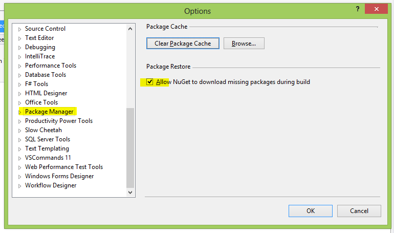
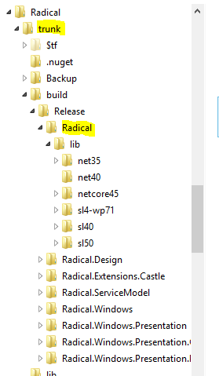

### In order to build the source the following SDK(s) are required:

* Windows Phone 8 SDK: required only to build the Phone projects;
* Expression Blend SDK(s):
	* Silverlight: [http://www.microsoft.com/en-us/download/details.aspx?id=3062](http://www.microsoft.com/en-us/download/details.aspx?id=3062)
	* WPF: [http://www.microsoft.com/en-us/download/details.aspx?id=10801](http://www.microsoft.com/en-us/download/details.aspx?id=10801)
* DirectX SDK: required only to build the “Xaml” (Silverlight, Phone and WPF) effects;
* The phone projects requires Visual Studio 2013 and Windows 8/8.1 RTM;
* the test projects runs on MSTest framework;
* the solution utilizes the NuGet Package restore feature, so be sure to enable it in the Visual Studio options:

### The build process output

At each build a set of post build events are executed to copy the build output into a predefined location:

a “build” folder is automatically created at the same level of the solution file, within the build folder a folder with the same name of the Build Configuration is created and inside that each project post build event creates its own output, creating a directory for the project, a lib folder and a set of directory for all the supported framework versions.

Accidentally the structure of the output is exactly the same structure of the NuGet package.