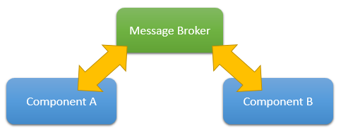

## Message Broker

The message broker pattern is a way to decouple the sender of a message and the subscribers of that message. In a standard event-based approach the subscriber needs in order to subscribe to an event:

  1. a reference to the publisher;
  2. knowledge of the event signature;

In lots of cases we need to be able to let 2 different components talk to each other in a more decoupled way since we have no easy way to satisfy the first point, in this cases introducing a third actor, the broker, that both knows is a really simple way to solve the original problem:



Radical has its own built-in broker implementation represented by the `IMessageBroker` interface and by the default `MessageBroker` implementation found in the Radical assembly.

### Usage

The first thing we need to do is to create an instance of the broker:

```csharp
var broker = new MessageBroker(new NullDispatcher());
```

> The broker itself has a dependency on the `IDispatcher` interface, an `IDispatcher` can be seen as a wrapper of the current `SynchronizationContext`. We wrap it in a `IDispatcher` instance to avoid coupling the broker to a specific implementation.

> In the above sample we are using a default `NullDispatcher` that does nothing and is a good choice for console or web applications where marshaling calls in the main thread is not mandatory. Radical.Windows comes with a built-in `WpfDispatcher`.

Once we have created the broker we can share it among all the components that need it:

```csharp
var sampleSender = new SenderComponent(broker);
var sampleReceiver = new ReceiverComponent(broker);
```

The third thing we need is something to exchange between components:

```csharp
class SampleMessage
{
}
```

> [POCO messages](poco-messages.md) are fully supported.

NOTE: It's also important to notice that all messages are shared in memory between publishers and subscribers, which means that there won't be any serialization happening and messages don't need to be serializable.

Now that we have 2 components, a broker and something that we want to share from one component to the other we can use it in the following manner:

```csharp
class SenderComponent
{
    IMessageBroker broker;

    public SenderComponent(IMessageBroker broker)
    {
        this.broker = broker;
    }

    public void Publish()
    {
        this.broker.Broadcast(sender: this, message: new SampleMessage());
    }
}
```

and from the receiver point of view:

```csharp
class ReceiverComponent
{    
    IMessageBroker broker;

    public SenderComponent( IMessageBroker broker )
    {
        this.broker = broker;
        this.broker.Subscribe<SampleMessage>(subscriber: this, (sender, message) => 
        {
            //handle the message here.
        } );
    }
}
```

### Dispatch vs. Broadcast

In the sample above the “sender” utilizes the `Broadcast` method, broadcasted messages will be delivered to subscribers asynchronously, and in parallel, thus the subscriber is invoked on a thread that is not the same as the publisher.

If, for some reason, we need to be have events dispatched in a synchronous manner we can use the `Dispatch` method that guarantees that all the subscribers are invoked on the same thread of the publisher in a serial manner.

#### Invocation Model

In our experience the most frequent usage of the broker is within the management of the UI of an application based on the MVVM pattern, which means that in most cases the subscriber of the event needs to access the UI, thus needs to run on the UI/main thread.

If we want to reduce the friction and we do not need to have control on the marshaling process we can ask the broker to automatically call the subscriber on the main thread for us:

```csharp
broker.Subscribe<SampleMessage>(this, InvocationModel.Safe, (sender, message) =>
{
    //this delegate is automatically invoked on the main thread.
});
```

Using the subscribe overload that accept an `InvocationModel` enumeration we can specify that we, as subscribers, need the subscription to be invoked on the main UI thread.

NOTE: The broadcast operation is still asynchronous and the broker only dispatches on the main thread the given delegate only when required.

### Inheritance support

One interesting thing we can do is subscribe to a base class in order to receive all the messages that inherits from the specified type:

```csharp
broker.Subscribe<IMessage>(this, (sender, msg) =>
{
    //all the messages that inherits from IMessage we'll be handled here.
});
```

In the above sample we are basically building a sort of catch all handler.
